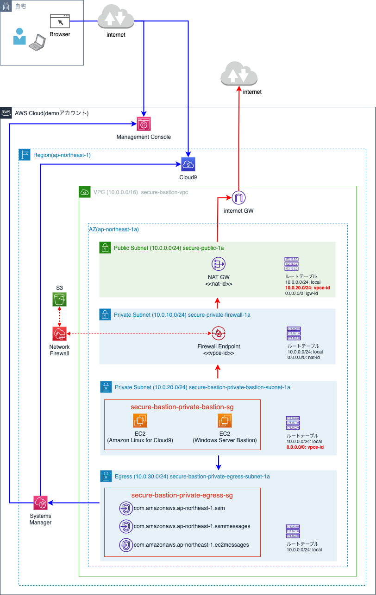

# AWS-Secure-Bastion
## Step 1
ブラウザ経由でLinux(Cloud9)やWindows Server(Fleet Manager)を操作。


## Step 2
インターネットへのアウトバウンド通信のため、Internet Gatewayを設置。アウトバウンド通信はNetwork FirewallでIPS/IDS。


step2のコメントブロックにアウトバウンド用リソースが定義されているので、コメント解除して実行。

**main.tf**
```
/* step2
 resource "aws_internet_gateway" "IGW" {
    vpc_id 
・・・
*/
```

## Others
* Terraform Stateファイル置場はS3で管理(事前にバケット準備)

**versions.tf**
```
backend "s3" {
    bucket = "secure-bastion-terraform-tfstate"
    key    = "terraform.tfstate"
    region = "ap-northeast-1"
  }
```

* AWS CLI実行準備
```
export AWS_ACCESS_KEY_ID="<your access key>"
export AWS_SECRET_ACCESS_KEY="<your secret key>"
``｀